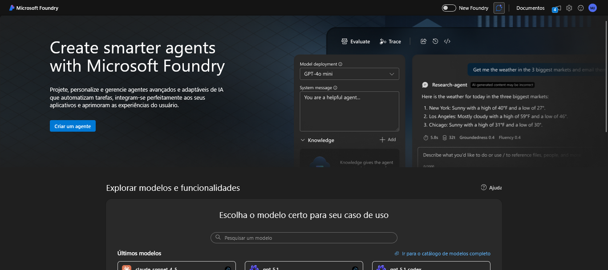
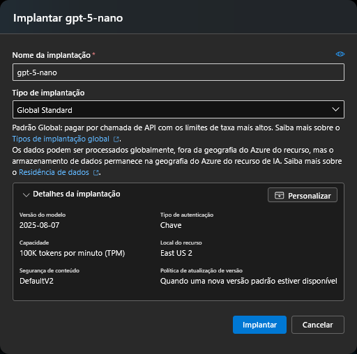
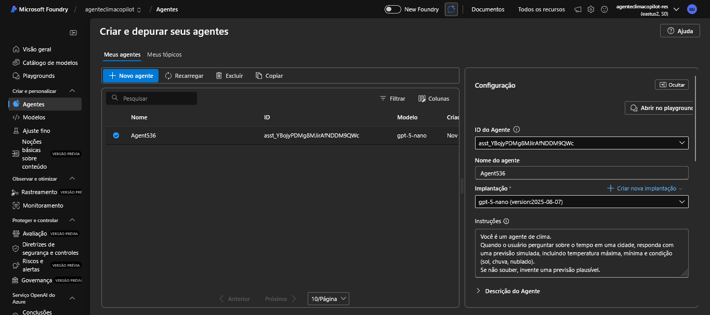
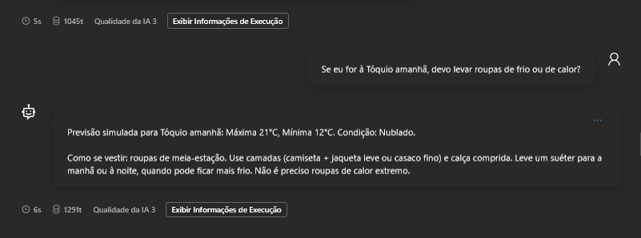

# 🌦️ Agente Copilot de Clima

## 🎯 Objetivo
Agente que responde perguntas sobre condições climáticas atuais e previsões simuladas, demonstrando como o Azure AI Foundry pode ser usado para criar um Copilot funcional.

## ⚙️ Como foi criado
1. Criei um hub e projeto no Azure AI Foundry.
2. Configurei um agente usando o modelo **gpt-5-nano**.
3. Defini instruções para que o agente respondesse perguntas sobre clima de forma plausível.
4. Testei com perguntas sobre algumas cidades e registrei as respostas.

## 📸 Prints
* Tela inicial do portal do Microsoft Azure

* Menu de 9 pontos aberto, mostrando o acesso ao AI Foundry

* Tela inicial do AI Foundry

* Criando um projeto

* Escolhendo o modelo

* Implantando modelo

* Configurando as instruções do agente

* Testando

## ✅ Resultados
- O agente responde perguntas sobre clima de forma clara e objetiva.
- Funciona para qualquer cidade, mesmo sem integração externa.
- O agente faz, sob solicitação, sugestões baseadas no clima reportado.
- Demonstra o uso prático do Foundry para criar agentes Copilot.

## 💡 Funcionalidades futuras
Esse agente pode evoluir para:
- Integração com serviços reais de clima (MSN Weather, Azure Maps).
- Alertas de clima severo.
- Sugestões mais complexas e proativas baseadas nos dados climáticos obtidos, conforme o contexto da conversa se expande.
